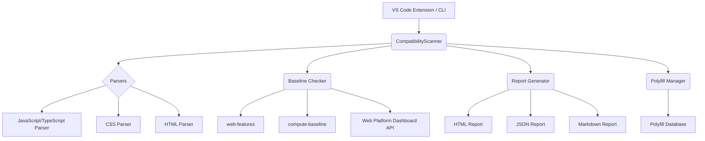

# Architecture

This document provides a detailed overview of the CodeSense architecture. Understanding the architecture will help you contribute to the project and extend its functionality.

## High-Level Overview

CodeSense is composed of several core components that work together to scan your code, check for web compatibility issues, and generate reports. The following diagram illustrates the high-level architecture:

## Core Components

### 1. Scanner Engine (`CompatibilityScanner`)

The Scanner Engine is the heart of CodeSense. It is responsible for:

*   Finding files to scan based on the user's configuration.
*   Orchestrating the parsing of those files using the appropriate parser.
*   Calling the Baseline Checker to determine the compatibility status of each detected feature.
*   Aggregating the results into a `ScanResult` object.

### 2. Parsers

CodeSense uses a collection of parsers to extract web features from different file types:

*   **JavaScript/TypeScript Parser**: Uses `@babel/parser` to create an Abstract Syntax Tree (AST) of the code and then traverses the AST to find calls to web APIs.
*   **CSS Parser**: Uses `postcss` to parse CSS files and extract CSS properties, values, and at-rules.
*   **HTML Parser**: Uses a regular expression-based parser to find HTML elements and attributes. (Note: This will be replaced with a more robust parser in the future).

### 3. Baseline Checker

The Baseline Checker is responsible for determining the Baseline status of a given web feature. It uses a multi-source approach to provide the most accurate and up-to-date information:

*   **`web-features`**: A local database of web features and their Baseline status.
*   **`compute-baseline`**: A tool for computing the Baseline status of a feature based on its Browser Compatibility Data (BCD).
*   **Web Platform Dashboard API**: A remote API for getting the latest Baseline status of a feature.

### 4. Report Generator

The Report Generator takes the results of a scan and generates a report in one of several formats:

*   **HTML**: An interactive report with charts and tables.
*   **JSON**: A machine-readable format for integration with other tools.
*   **CSV**: A simple format for use in spreadsheets.
*   **Markdown**: A human-readable format for sharing in pull requests and other documents.

### 5. Polyfill Manager

The Polyfill Manager is responsible for all things related to polyfills:

*   **Recommending polyfills**: Based on the results of a scan, the Polyfill Manager can recommend polyfills for features that are not widely supported.
*   **Generating polyfill bundles**: The Polyfill Manager can generate a polyfill bundle that can be included in your project.
*   **Injecting polyfills**: The Polyfill Manager can automatically inject the necessary polyfills into your project.

## Data Sources

CodeSense relies on the following data sources to provide accurate and up-to-date information about web features and their compatibility:

*   **`web-features` npm package**: The official source of truth for the Baseline status of web features.
*   **Web Platform Dashboard API**: A remote API for getting the latest Baseline status of a feature.
*   **`compute-baseline`**: A tool for computing the Baseline status of a feature based on its Browser Compatibility Data (BCD).
*   **Built-in polyfill database**: A curated database of polyfills for common web features.
